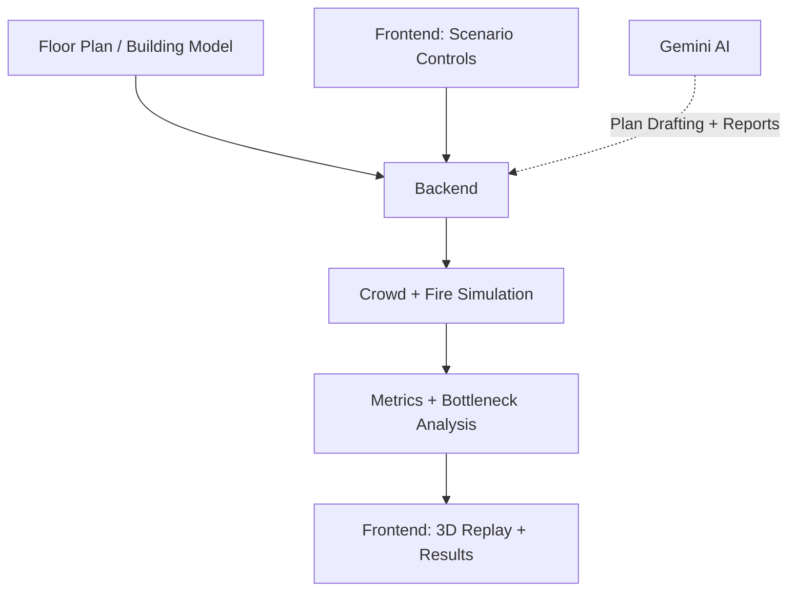

# FirePass Architecture

```mermaid
flowchart TD
    A[Floor Plan / Building Model] --> B[Backend]
    C[Frontend: Scenario Controls] --> B
    B --> D[Crowd + Fire Simulation]
    D --> E[Metrics + Bottleneck Analysis]
    E --> F[Frontend: 3D Replay + Results]
    G[Gemini AI] -. Plan Drafting + Reports .-> B
```

Fire and smoke modeling is illustrative. Not a compliance tool.
